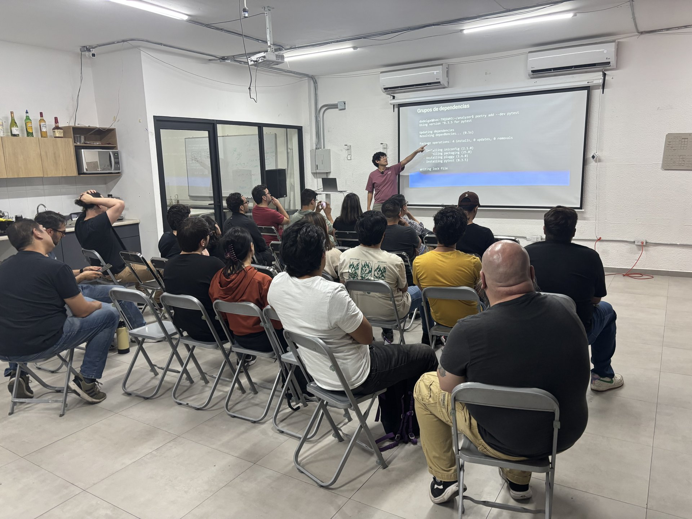
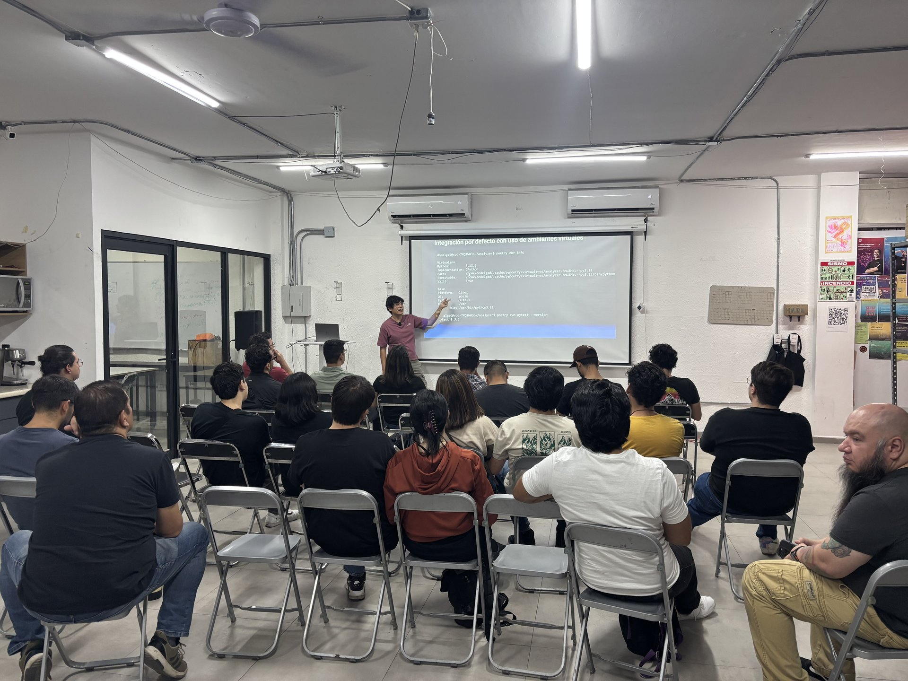

¡Muchas gracias a todas y todos los que nos acompañaron en nuestra **primera reunión presencial** de Pythonistas GDL! 🎉🐍

Fue una tarde llena de entusiasmo, ideas y muy buena vibra. Tuvimos una gran participación y queremos agradecer sinceramente el interés, las preguntas y la energía con la que se sumaron a esta nueva comunidad.

🙏 **Gracias especiales a [HackerGarage](https://hackergarage.mx)** por brindarnos el espacio para hacer posible este encuentro.

---

## 📚 Presentaciones

Aquí pueden consultar las presentaciones que compartieron nuestros ponentes:

- 📄 [Conoce Pythonistas GDL – Daniel Delgado & Juan Carlos Sedano](charla_pythonistas_gdl.pdf)
- 📄 [Poetry: El package manager para empaquetarlos a todos – Daniel Delgado](poetry.pdf)

---

Los tres afortunados ganadores de las **playeras oficiales** de Pythonistas GDL que rifamos entre quienes llenaron la encuesta:







---

## 📅 ¿Qué sigue?

Nos emociona anunciar que **en junio tendremos nuestra próxima reunión presencial**. Ya estamos trabajando en el programa, y pronto compartiremos todos los detalles.

**¡Nuestras redes sociales!**  
Siempre intentaremos que esta página sea el lugar donde encuentres la información más actualizada, pero también puedes seguirnos en nuestras redes sociales para enterarte de todo lo que pasa en la comunidad:

- [Twitter](https://twitter.com/pythonistasgdl)
- [Facebook](https://www.facebook.com/pythonistasgdl)
- [Instagram](https://www.instagram.com/pythonistasgdl)
- [LinkedIn](https://www.linkedin.com/company/pythonistas-gdl)

También tenemos YouTube y TikTok, pero aún no tenemos nada en ellos:

- [YouTube](https://www.youtube.com/channel/UC1v0g7X2x4J6G5Q3q8f9Z1A)
- [TikTok](https://www.tiktok.com/@pythonistasgdl)

---

## 🚧 Proyectos

Francisco Ruvalcaba inició un proyecto para crear un clon de [linktr.ee](https://linktr.ee). Al momento de escribir este post, el proyecto está corriendo [aquí](https://frantizek.github.io/Pythonistas-GDL/).

[Y el código está aquí.](https://github.com/frantizek/Pythonistas-GDL)

Nos parece un proyecto que, aparte de ser muy útil (la idea sería usarlo para compartir los links de nuestras redes sociales), es excelente para aprender porque puede incorporar cosas como FastAPI, acceso a bases de datos, autenticación, etc. Vamos a tratar de darle continuidad, desplegarlo en un servidor y usarlo en pythonistas-gdl.org. 

Si tienes alguna idea de proyecto, o quieres colaborar en alguno de los que ya tenemos, ¡escríbenos!

💌 Si tienes dudas, sugerencias o quieres colaborar, escríbenos a [contacto@pythonistas-gdl.org](mailto:contacto@pythonistas-gdl.org).  
¡Nos encantará saber de ti!

---

¡Gracias por hacer comunidad con nosotros! 💛
